# STA实验报告


[1] [作者的代码:guotaowang/STANet (github.com)](https://github.com/guotaowang/STANet)

[2] [修改后本实验代码:Full-Adder/STA_trial (github.com)](https://github.com/Full-Adder/STA_trial)

## 实验介绍

此次实验是论文《[From Semantic Categories to Fixations: A Novel Weakly-supervised Visual-auditory Saliency Detection Approach ](https://openaccess.thecvf.com/content/CVPR2021/papers/Wang_From_Semantic_Categories_to_Fixations_A_Novel_Weakly-Supervised_Visual-Auditory_Saliency_CVPR_2021_paper.pdf)》的代码实现。

针对目前只有少数带有真实注视点视听序列的问题，论文中提出了一种弱监督的方式，使用一种遵循粗到细(coarse-to-fine)策略的选择性类激活映射(SCAM)，仅通过视频类别标签来获得空间S-时间T-音频A环境中最显著的区域。并且预测结果后续可以作为伪-真实数据训练一个新的STA网络。

实验总体可以分为三步：

1. *SCAM training*

> **Course** ：分别训练 $S_{coarse}$, $SA_{coarse} $, $ {ST}_{coarse} $，输入大小256确保物体定位准确。
>
> **Fine** ：分别再训练  $S_{fine}$, $ {SA}_{fine} $, $ {ST}_{fine} $，输入大小356确保区域定位准确。

2. *pseudoGT generation*

> 为了便于处理矩阵数据时的展示，在流畅的帧间进行粗糙定位和伪-GT数据后处理时使用 $Matlab2016b$ 进行处理。

3. *STA training*

> 使用带有生成伪-GT的AVE视频帧来训练STA模型。

项目目录如下：

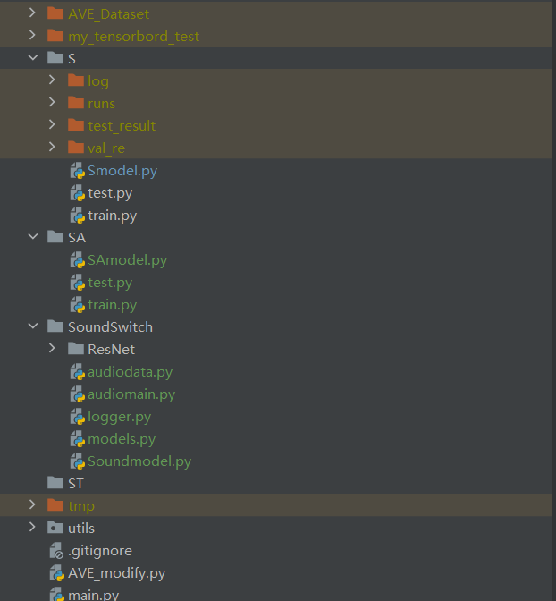

## AVE数据集介绍

AVE数据集结构如下：

```
      │  Annotations.txt
      │  ReadMe.txt
      │  testSet.txt
      │  trainSet.txt
      │  valSet.txt
      └─AVE
        ---1_cCGK4M.mp4
        --12UOziMF0.mp4
        --5zANFBYzQ.mp4
        --9O4XZOge4.mp4
        --bSurT-1Ak.mp4
```

AVE 数据集包含4096个时长为10s的MP4视频，每个视频被唯一地标注了一个视频种类标签，数据集共被标注了28个视频分类标签。视频的类别等信息存储在$Annotations.txt$, $test.txt$, $train.txt$ 中，存储数据如下：


| Category        | VideoID     | Quality | StartTime | EndTime |
|-----------------|-------------|---------|-----------|---------|
| Church bell     | RUhOCu3LNXM | good    | 0         | 10      |
| Church bell     | MH3m4AwEcRY | good    | 6         | 8       |
| Acoustic guitar | -AFx6goDrOw | good    | 0         | 10      |
| ...             | ...         | ...     | ...       | ...     |

从左到右分别为视频的类别标签，视频的名称(ID)，视频对分类结果的质量，和类别标签在视频中开始和结束的时间(s)。其中，训练集包含3339个MP4文件，占比81.5%，验证集和测试集分别包含402个MP4文件，占比9.8%。

## 实验过程

### 数据准备

> 解压原始数据集后，修改文件夹，所有MP4视频存放于Video_path目录下，运行`AVE_modify.py`, 即可获得存放在`Pic_path`、`Audio_path`、`H5_path` 中 `.jpg` 和 `.h5` 文件.

在训练前需要将数据集MP4文件转化成每帧的.jpg、音频的.wav/.h5格式文件，本实验提取了视频对应的 $StartTime-EndTime$  中每秒的视频帧和每秒的音频特征（例如在4-7s的视频中提取4.5s的视频帧和4-5s的音频特征作为4-5s的空间和音频特征）。

#### 读取$train.txt/test.txt/val.txt$文件

> 数据集处理完毕后，从`txt`中获取文件名，向`dataset`输送。

```python
def readDataTxt(DataSet_path, mode):
    txt_path = os.path.join(DataSet_path, txt_name[mode])
    with open(txt_path, 'r', encoding="utf-8") as f:
        if mode == "all":
            f.readline()
        dataSet = []
        for data in f.readlines():
            data = data.strip().split('&')
            data_list = [data[1], category_id[data[0]], int(data[3]), int(data[4])]
            dataSet.append(data_list)

    return dataSet
# 返回文件名，对应类别，开始时间，结束时间 的列表
```

#### 数据集类

```python
class AVEDataset(Dataset):  # 数据集类
    def __init__(self, pic_dir, h5_dir, mode, transform=None, STA_mode="S"):
        assert mode in list(dft.get_txtList().keys()), "mode must be train/test/val"
        assert STA_mode in ["S", "ST", "SA", "STA"], "STA_mode must be S/SA/ST/STA"
        self.pic_dir = pic_dir
        self.h5_dir = h5_dir
        self.mode = mode
        self.transform = transform
        self.STA_mode = STA_mode
        self.class_dir = dft.get_category_to_key()
        data_folder_list = dft.readDataTxt(os.path.join(self.pic_dir, "../"), mode)
        self.data_list = []
        for idata in data_folder_list:
            for idx in range(idata[-2], idata[-1]):
                self.data_list.append([os.path.join(idata[0], "{:0>2d}".format(idx)), idata[1]])

    def __len__(self):
        return len(self.data_list)

    def __getitem__(self, idx):
        data = self.data_list[idx]

        img_path = os.path.join(self.pic_dir, data[0]+".jpg")  # 图片绝对地址
        image = Image.open(img_path).convert('RGB')  # 打开图片，并转化为RGB格式
        image = self.transform(image)  # 将图片转化为tensor

        class_id = int(data[1])  # 获得图像标签
        label = np.zeros(len(self.class_dir), dtype=np.float32)
        label[class_id] = 1  # one-hot编码

        if self.STA_mode == "S":
            return data[0], image, class_id, label  # 返回 图片地址 图片tensor 标签 onehot标签

        elif self.STA_mode == "SA":
            h5_path = os.path.join(self.h5_dir, data[0]+".h5")
            with h5py.File(h5_path, 'r') as hf:
                audio_features = np.float32(hf['dataset'][:])  # 5,128
            audio = torch.from_numpy(audio_features).float()
            return data[0], image, audio, class_id, label  # 返回 图片地址 图片tensor 标签 onehot标签

        elif self.STA_mode == "ST":
            pass

        else:   # "STA"
            pass

```

#### 数据加载器

```python
def get_dataLoader(Pic_path=r"../AVE_Dataset/Video", H5_path=r"../AVE_Dataset/H5", train_mode="train",
                   STA_mode="S", batch_size=8, input_size=300, crop_size=256):
    mean_vals = [0.485, 0.456, 0.406]  # 数据均值
    std_vals = [0.229, 0.224, 0.225]  # 数据标准差

    tsfm_train = transforms.Compose([transforms.Resize((input_size, input_size)),
                                     transforms.RandomCrop((crop_size, crop_size)),
                                     transforms.ColorJitter(brightness=0.3, contrast=0.3, saturation=0.3, hue=0.1),
                                     transforms.ToTensor(),
                                     transforms.Normalize(mean_vals, std_vals),
                                     ])

    tsfm_test = transforms.Compose([transforms.Resize((crop_size, crop_size)),
                                    transforms.ToTensor(),
                                    transforms.Normalize(mean_vals, std_vals),
                                    ])

    if train_mode == "train":
        img_train = AVEDataset(pic_dir=Pic_path, h5_dir=H5_path, mode="train", transform=tsfm_train, STA_mode=STA_mode)
        train_loader = DataLoader(img_train, batch_size=batch_size, shuffle=True, drop_last=True)
        print("dataSet.len:", len(img_train), "\t dataLoader.len:", len(train_loader), 'batch_size:', batch_size)
        return train_loader
    elif train_mode == "test":
        img_test = AVEDataset(pic_dir=Pic_path, h5_dir=H5_path, mode="test", transform=tsfm_test, STA_mode=STA_mode)
        test_loader = DataLoader(img_test, batch_size=batch_size, shuffle=False, drop_last=True)
        print("dataSet.len:", len(img_test), "\t dataLoader.len:", len(test_loader), 'batch_size:', batch_size)
        return test_loader
    elif train_mode == "val":
        img_val = AVEDataset(pic_dir=Pic_path, h5_dir=H5_path, mode="val", transform=tsfm_test, STA_mode=STA_mode)
        val_loader = DataLoader(img_val, batch_size=batch_size, shuffle=False, drop_last=True)
        print("dataSet.len:", len(val_loader), "\t dataLoader.len:", len(val_loader), 'batch_size:', batch_size)
        return val_loader
```

### S model

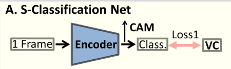


| x_name      | later_name                   | detail                                    | output_size         |
| ----------- | ---------------------------- | ----------------------------------------- | ------------------- |
| x           | input                        | none                                      | [1, 3, 256, 256]    |
| x1          | features(x)                  | nn.Sequential(*ResNetX[:7])               | [1, 1024, 19, 19]   |
| x11         | extra_convs(x1)              | nn.Conv2d(1024, 28, 1)                    | [1, 28, 19 ,19]     |
| x_att       | self_attention               |                                           |                     |
| _f          | extra_projf(x11)             | Conv2d(28, 14, 1).view(b, -1, w* h)       | [1, 14, 19*19]      |
| _g          | extra_projg(x11)             | Conv2d(28, 14, 1).view(b, -1, w* h)       | [1, 14, 19*19]      |
| _h          | extra_projh(x11)             | Conv2d(28, 28, 1).view(b, -1, w* h)       | [1, 28, 19*19]      |
| _atte       | bmm-矩阵相乘                 | softmax(tor.bmm(f[0,2,1],g))              | [1, 19\*19, 19\*19] |
| _self_atte  | 相乘后展开                   | bmm(h, atte).view(b, c, w,h)              | [1，28, 19, 19]     |
| _self_mask  | extra_gate(self_atte)        | sogmoid(Conv2d(28, 1, 1))                 | [1, 1, 19, 19]      |
|             |                              | self_mask * x11                           | [1, 28, 19, 19]     |
| x2          | extra_conv_fusion(x11,x_att) | Conv2d(56, 28, 1, True)                   | [1, 28, 19, 19]     |
| x22         | extra_ConvGRU(x2,x11)        |                                           |                     |
| _update     | tor.cat(x2,x11)后            | sigmoid(Conv2d(56, 28,1))                 | [1, 28, 19, 19]     |
| _reset      | tor.cat(x2,x11)后            | sigmoid(Conv2d(56, 28,1))                 | [1, 28, 19, 19]     |
| _out_inputs | cat([x11, x_att * reset])    | tanh(Conv2d(56, 28,1))                    | [1, 28, 19, 19]     |
|             | return                       | x_att* (1 - update) + out_inputs * update | [1, 28, 19, 19]     |
| map_1       |                              | x11.clone()                               |                     |
| x1ss        |                              | avg_pool2d(x11, 19, 19).view(-1, 28)      | [1, 28]             |
| map_2       |                              | x22.clone()                               |                     |
| x2ss        |                              | avg_pool2d(x22, 19, 19).view(-1, 28)      | [1, 28]             |
|             | return                       | x1ss, x2ss,map1, map2                     |                     |

（以batch_size = 1为例）

对应图中：

`F.softmax(x1ss, dim=1).data.squeeze()`后获得对应28个类别的预测概率，最大值即为预测的对应类别。

$atts = (map1[i] + map2[i]) / 2 $ 作为CAM结果。

##### loss

```python
loss_train = F.multilabel_soft_margin_loss(x1ss, label1) +
			F.multilabel_soft_margin_loss(x2ss, label1)
```

$MultiLabelSoftMarginLoss$ 针对多分类，且每个样本只能属于一个类的情形

$\operatorname{MultiLabelSoftMarginLoss}(x, y)=-\frac{1}{C} * \sum_{i} y[i] * \log \left((1+\exp (-x[i]))^{-1}\right)+(1-y[i]) * \log \left(\frac{\exp (-x[i])}{1+\exp (-x[i])}\right) $

相当于对$min-batch$个多个交叉熵损失求平均值。


### SA model

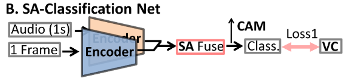


| x_name      | later_name                                                                            | detail                                            | output_size      |
| ----------- | ------------------------------------------------------------------------------------- | ------------------------------------------------- | :--------------- |
| aud1        |                                                                                       | input_audio                                       | [1, 81, 199]     |
| _aud1       | aud1.unsqueeze(1)                                                                     | 在第一维插入一个维度                              | [1, 1, 81, 199]  |
| a1          | audio_model(_aud1)                                                                    | nn.Sequential(*ResNet[:9])                        | [1, 8192]        |
| a1          | extra_audio_d(a1)                                                                     | nn.Linear(8192, 2048)                             | [1, 2048]        |
|             | return                                                                                | a1.unsqueeze(2).unsqueeze(2)                      | [1, 2048, 1, 1]  |
| Aup         | Aup(a1)                                                                               |                                                   |                  |
|             | [nn.ConvTranspose2d简介](https://blog.csdn.net/qq_27261889/article/details/86304061/) | nn.ConvTranspose2d(2048,2048,3,1,0) nn.ReLU(True) | [1, 2048, 3, 3]  |
|             |                                                                                       | nn.ConvTranspose2d(2048,2048,3,1,0) nn.ReLU(True) | [1, 2048, 4, 4]  |
|             | return                                                                                | nn.ConvTranspose2d(2048,2048,3,1,0)               | [1, 2048, 5, 5]  |
| convs_Aup   | extra_convs(Aup)                                                                      |                                                   |                  |
|             |                                                                                       | nn.Conv2d(2048, 28, 1)                            | [1, 28, 5, 5]    |
|             | return                                                                                | nn.Conv2d(28, 1, 1) nn.Sigmoid()                  | [1, 1, 5, 5]     |
| x           |                                                                                       | input_pic                                         | [1, 3, 256, 256] |
| x1          | features(x)                                                                           | nn.Sequential(*ResNetX[:8])                       | [1, 2048, 8, 8]  |
| x1          | extra_video_d(x1)                                                                     |                                                   |                  |
|             |                                                                                       | nn.Conv2d(2048, 2048,3, 1), nn.ReLU(True)         | [1, 2048, 7, 7]  |
|             |                                                                                       | nn.Conv2d(2048, 2048,3, 1), nn.ReLU(True)         | [1, 2048, 6, 6]  |
|             |                                                                                       | nn.Conv2d(2048, 2048,3, 1), nn.ReLU(True)         | [1, 2048, 5, 5]  |
|             | return                                                                                | nn.Conv2d(2048, 28, 1)                            | [1, 28, 5, 5]    |
| x_att       | self_attention                                                                        |                                                   |                  |
| _f          | extra_projf(x1)                                                                       | Conv2d(28, 14, 1).view(b, -1, w* h)               | [1, 14, 5*5]     |
| _g          | extra_projg(x1)                                                                       | Conv2d(28, 14, 1).view(b, -1, w* h)               | [1, 14, 5*5]     |
| _h          | extra_projh(x1)                                                                       | Conv2d(28, 28, 1).view(b, -1, w* h)               | [1, 28, 5*5]     |
| _atte       | softmax(tor.bmm(f[0,2,1],g))                                                          | bmm-矩阵相乘                                      | [1, 5\*5, 5\*5]  |
| _self_atte  | bmm(h,atte).view(b,c,w,h)                                                             | 相乘后展开                                        | [1，28, 5, 5]    |
| _self_mask  | extra_gate(self_atte)                                                                 | sogmoid(Conv2d(28,1,1))                           | [1, 1, 5, 5]     |
|             | return                                                                                | self_mask * x11                                   | [1, 28, 5, 5]    |
| xxatt       |                                                                                       | F.relu(x1 + x_att)                                | [1, 28, 5, 5]    |
| xxApu       |                                                                                       | F.relu(x1 + x1 * convs_Aup))                      | [1, 28, 5, 5]    |
| xxattApu    |                                                                                       | torch.cat(xxatt,xxApu,1)                          | [1, 56, 5, 5]    |
| x2          | extra_conv_fusion(xxattApu)                                                           | Conv2d(56,28,1,True)                              | [1, 28, 5, 5]    |
| x22         | extra_ConvGRU(x2,x1)                                                                  |                                                   |                  |
| _update     | tor.cat(x2,x1,1)后                                                                    | sigmoid(Conv2d(56,28,1))                          | [1, 28, 5, 5]    |
| _reset      | tor.cat(x2,x1,1)后                                                                    | sigmoid(Conv2d(56,28,1))                          | [1, 28, 5, 5]    |
| _out_inputs | cat([x2, x1 * reset])                                                                 | tanh(Conv2d(56,28,1))                             | [1, 28, 5, 5]    |
|             |                                                                                       | x1*(1-update)+out_inputs\*update                  | [1, 28, 5, 5]    |
| map_1       | x1.clone()                                                                            |                                                   |                  |
| x1ss        |                                                                                       | avg_pool2d(x1,5,5).view(-1,28)                    | [1, 28]          |
| map_2       | x2.clone()                                                                            |                                                   |                  |
| x2ss        |                                                                                       | avg_pool2d(x22,5,5).view(-1,28)                   | [1, 28]          |
|             | return                                                                                | x1ss, x2ss,map1, map2                             |                  |

（以batch_size = 1为例）

> 表中对应函数的默认位置参数如下：
>
> nn.Conv2d(input_size,output_size,k_size,bias)
>
> nn.ConvTranspose2d(input_size,output_size,k_size,strip,padding)

同理，对应图中：

`F.softmax(x1ss, dim=1).data.squeeze()`后获得对应28个类别的预测概率，最大值即为预测的对应类别。

$atts = (map1[i] + map2[i]) / 2$  作为CAM结果。


##### loss

SA的loss与S模型的loss一样：

```python
loss_train = F.multilabel_soft_margin_loss(x1ss, label1) +
			F.multilabel_soft_margin_loss(x2ss, label1)
```


### 模型训练与测试

#### train.py

```python
for epoch in range(total_epoch,args.epoch):
    model.train()
    losses.reset()

    for idx, dat in enumerate(train_loader):  # 从train_loader中获取数据

        img_name1, img1, inda1, label1 = dat	# 获取数据


        label1 = label1.cuda(non_blocking=True)
        img1 = img1.cuda(non_blocking=True)

        x11, x22, map1, map2 = model(img1)	# 向前传播
        loss_train = F.multilabel_soft_margin_loss(x11, label1) + 
        			F.multilabel_soft_margin_loss(x22, label1)

        optimizer.zero_grad()
        loss_train.backward()	# 向后传播梯度
        optimizer.step()		# 优化网络权重

        losses.update(loss_train.data.item(), img1.size()[0])

        if (idx + 1) % args.disp_interval == 0:	# 打印loss
            dt = datetime.now().strftime("%y-%m-%d %H:%M:%S")
            print('time:{}\t'
                  'Epoch: [{:2d}][{:4d}/{:4d}]\t'
                  'LR: {:.5f}\t'
                  'Loss {loss.val:.4f} ({loss.avg:.4f})\t'.format(
                dt, epoch + 1, (idx + 1), len(train_loader),
                optimizer.param_groups[0]['lr'], loss=losses))

    if (epoch + 1) % args.val_Pepoch == 0:	# 验证
        print("------------------------------val:start-----------------------------")
        with torch.no_grad():
            test(model, args.Pic_path, True, epoch, args.batch_size,
                 args.input_size, args.dataset_name,writer)
        print("------------------------------ val:end -----------------------------")
```

## 实验结果

### S model

训练轮数：20

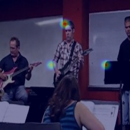

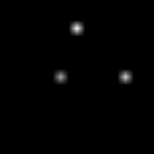


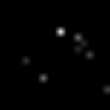

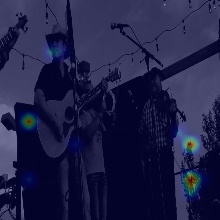

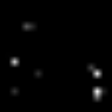


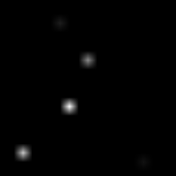

训练时的验证集损失：

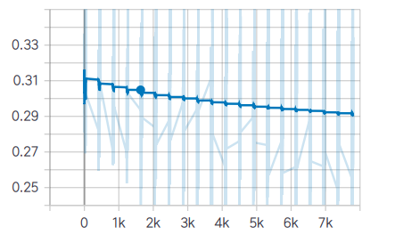

### SA model

训练轮数：115组数据

训练时的验证集损失：

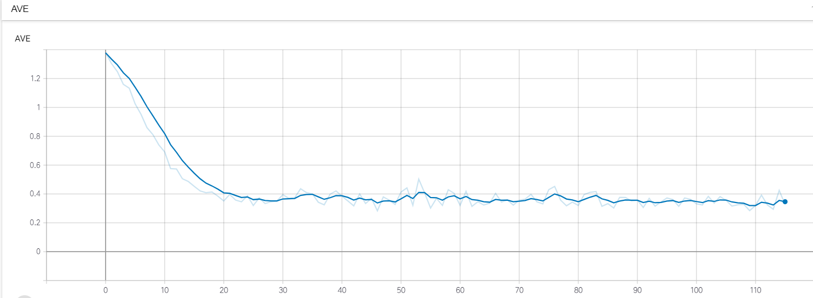
